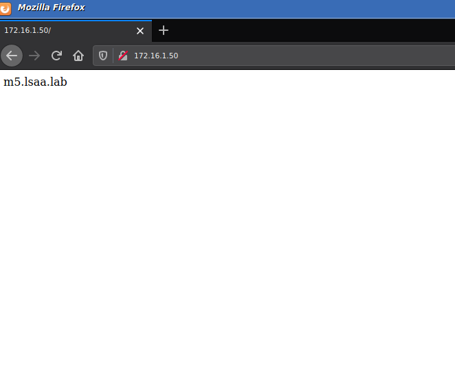
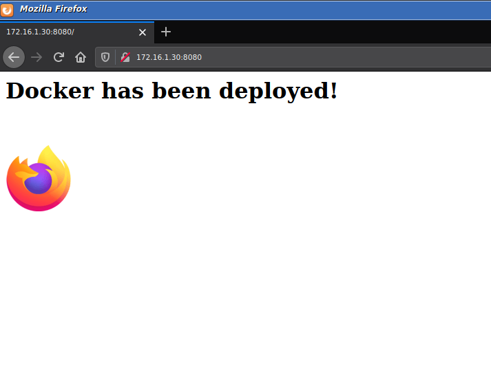

# Automating infrastructure deployment using Ansible
* * *

We are going to take a look at infrastructure deployment automation with Ansible. Such mechanisms are widely used in DevOps and many other scenarios.

## Why to use automation?

Well because obviously, it does take some of work off your shoulders, also provides a solution where you can deploy an environment with the same characteristics. Or otherwise we remove the human factor, where a mistake can be done and systems are not in 1:1 ratio <i>(lets say we do a certain configuration on machine A, but we make a mistake when configuring* machine B, => <strong>A:B != 1:1</strong>)</i> . Well it doesn’t assure that everything will be OK, because if mistake is made in the <strong>Playbook</strong> (<i>Ansible specific configuration, like a recipe on what to do</i>), that means the error will be replicated among other machines, but every configuration will contain the same mistake too, so it still is 1:1. In DevOps it is a requirement, to test the code base in identical environment. There are many solutions out there, to accomplish this task. Chef, Puppet, the Saltstack, Ansible, etc...
In this post we are going to use Ansible.

> \*Configuration – Like a state of the whole OS, <u> NOT a configuration file of a application</u>

## How it works?

In Ansible there are Modules, Plays and Playbooks. Eeach Play is made out of Modules, and the Playbook contains all Plays.
Modules do the actual work, lets they are the interface between the shell of the underlying OS and Ansible. Also we can get extra modules from the Ansible Galaxy (https://galaxy.ansible.com/), or write a script ourselves, which makes it very flexible tool.


### More on the Playbook

As I said above, each Playbook is made out of Plays.
A Play is a single set of operations, which operations are carried out by Modules.
Module can be for example a command to create a new file, install program,change program’s configuration file, etc…
This is very powerful because we can create list of tasks to be done on multiple hosts, also we can specify via a host name, on which machine exactly what to be done. Hosts are also know as Inventory (more about here - https://docs.ansible.com/ansible/latest/user_guide/intro_inventory.html).
To authenticate with the hosts we will use SSH key (Ansible support Windows too, using Remote Management (WinRM)). There is a Python backend which handles the tasks, pushing them to the hosts via SSH.
Playbooks are written in <i>YAML</i>.

Here we can see an anatomy of a Playbook, which will install Apache Web Server on list of host computers and change it’s default homepage to the host name of the computer.


```
---

- hosts: web-server
  become: true

  tasks:
  - name: Install HTTPD
    dnf: name=httpd state=present
  - name: Start and Enable HTTPD
    service: name=httpd state=started enabled=true
  - name: Allow in Firewalld
    firewalld: service=http state=enabled permanent=yes immediate=yes
  - name: Create file with the $HOSTNAME
    shell: echo "$HOSTNAME" > /var/www/html/index.html
    args:
            executable: /bin/bash
```

> `---` - that is where the playbook begins, in one file there can be multiple playbooks
> `- hosts: web-servers` - that show on which list of hosts to run the plays bellow
> we can set it up inside /etc/ansible/hosts with the following syntax
> [web-servers] – this can be whatever you name it
> IP address or host name
> IP address or host name
> IP address or host name
> …

In the `-tasks: ` section we set the tasks to be done

each task starts with a `- name: ` and bellow we call the module to do the task

> `dnf ` is a module that works with the DNF CentOS’s package manager, in this case we check if httpd(apache) is installed(`state= present`), and if it is not we install it.
> `service`  - interacts with the system services, etc …

To learn more you can visit the official <a href="https://docs.ansible.com/ansible/latest/index.html" target="_blank">ansible documentation</a>

There are 2 syntax that we can use it the playbook file: 

```
dnf: name=httpd state=present
```
and

```
    shell: echo "$HOSTNAME" > /var/www/html/index.html
    args:
            executable: /bin/bash
```

It is a good practice to use only 1 style of typing.

> To learn more about Ansible, please check out the <a href="https://docs.ansible.com/ansible/latest/index.html" target="_blank">official documentation</a>.
> There is RedHat Enterprice Paid version,In this tutorial we are using the community, which is free. <br>
> Ansible is big and powerful tool, in this quick introduction we are only scratching the surface.


### Lets run the script

```
$ ansible-playbook playbook1.yaml -K
BECOME password: 

PLAY [web-server] ***************************************************************************

TASK [Gathering Facts] **********************************************************************
ok: [m5]

TASK [Install HTTPD] ************************************************************************
changed: [m5]

TASK [Start and Enable HTTPD] ***************************************************************
changed: [m5]

TASK [Allow in Firewalld] *******************************************************************
changed: [m5]

TASK [Create file with the $HOSTNAME] *******************************************************
changed: [m5]

PLAY RECAP **********************************************************************************
m5                         : ok=5    changed=4    unreachable=0    failed=0    skipped=0    rescued=0    ignored=0   

[ivan@M1 ~]$ curl m5
m5.lsaa.lab
```

And we can see that indeed the changes had been done.

<a href="pics/ansible-intro/pic1.png" target="_blank"></a>


## Lets take a look at something more complicated – Deploying docker Nginx image on multiple machines

> All the files used at this article will be available at my <a href="https://github.com/P4nd4233/automation" target="_blank">GitHub Repo</a> for the automation articles.

#### This script is very CentOS/RedHad specific, because i am running CentOS Environment.

`docker-nginx.yaml`
```
---

- hosts: docker-servers
  become: true

  tasks:
          - name: Add Docker repo
            get_url:
             url: https://download.docker.com/linux/centos/docker-ce.repo
             dest: /etc/yum.repos.d/docker-ce.repo

          - name: Install containerd.io
            dnf:
             name: 'https://download.docker.com/linux/centos/7/x86_64/stable/Packages/containerd.io-1.2.13-3.2.el7.x86_64.rpm'
             state: present
           
          - name: Install docker-ce
            dnf:
             name: docker-ce
             state: present
          
          - name: Install python Docker Module
            pip:
                    name: docker

          - name: Add user to docker group
            user:
                    name: ivan
                    groups: docker
                    append: yes

          - name: Enable and start docker daemon
            service:
             name: docker
             state: started
             enabled: true

          - name: Copy Site Contents to Remote Dir
            shell: mkdir /tmp/temp-directory-101 ;wget 172.16.1.10/site.zip -O /tmp/temp-directory-101/site.zip; unzip /tmp/temp-directory-101/site.zip -d /home/ivan/

          - name: Creating the Container
            docker_container:
                    name: nginx_container
                    image: nginx:latest
                    state: started
                    published_ports: 8080:80
                    volumes:
                            - "/home/ivan/site:/usr/share/nginx/html:ro"
                    detach: yes

          - name: Add docker0 to trusted Firewalld zone
            shell: firewall-cmd --add-interface docker0 --zone trusted --permanent; firewall-cmd --reload


          - name: Add ports to Firewalld
            firewalld:
             port: 8080/tcp
             permanent: yes
             immediate: yes
             state: enabled

```

To run the playbook we will run `ansible-playbook /home/ivan/docker-nginx.yaml -K`

`-K` - will ask for us the sudo password.

```
$ ansible-playbook docker-nginx.yaml -K
BECOME password: ***********

PLAY [docker-servers] **********************************************************************************************************************************************************************************************

TASK [Gathering Facts] *********************************************************************************************************************************************************************************************
ok: [m2]
ok: [m3]

TASK [Add Docker repo] *********************************************************************************************************************************************************************************************
changed: [m2]
changed: [m3]

TASK [Install containerd.io] ***************************************************************************************************************************************************************************************
changed: [m2]
changed: [m3]

TASK [Install docker-ce] *******************************************************************************************************************************************************************************************
changed: [m3]
changed: [m2]

TASK [Install python Docker Module] ********************************************************************************************************************************************************************************
changed: [m2]
changed: [m3]

TASK [Add user to docker group] ************************************************************************************************************************************************************************************
changed: [m2]
changed: [m3]

TASK [Enable and start docker daemon] ******************************************************************************************************************************************************************************
changed: [m2]
changed: [m3]

TASK [Copy Site Contents to Remote Dir] ****************************************************************************************************************************************************************************
changed: [m2]
changed: [m3]

TASK [Creating the Container] **************************************************************************************************************************************************************************************
changed: [m2]
changed: [m3]

TASK [Add docker0 to trusted Firewalld zone] *********************************************************************************************************************************************************************************
changed: [m2]
changed: [m3]

TASK [Add ports to Firewalld] **************************************************************************************************************************************************************************************
changed: [m3]
changed: [m2]

PLAY RECAP *********************************************************************************************************************************************************************************************************
m2                         : ok=12   changed=11   unreachable=0    failed=0    skipped=0    rescued=0    ignored=0   
m3                         : ok=12   changed=11   unreachable=0    failed=0    skipped=0    rescued=0    ignored=0 
```

Lets check if the sites are up.

<a href="pics/ansible-intro/pic2.png" target="_blank"></a>

As we can see the process, is done.

A simple webpage with JS, that detects what web browser i am using.

## Explanation

> DISCLAIMER: This is playbook is written in very "hacky" way

The first module we use `get_url` - downloads the .repo for the docker-ce repository, and places it in the repositories dir

After that we use standard `dnf` module to install containerd-io (CentOS specific) and docker-ce.

We add our user to the docker group via `user` module, and use `service` to start docker daemon.

After that it comes the "hacky" part:

In this version of Ansible there is no clean way to copy a whole directory and its contents to a remote server, so we sill use `shell` (you guessed it - executes a command in the shell).
So I have hosted the site’s contents inside a web directory, and we run `wget` to download these files (we can run whatever we want, if there were more files we would download a zip and then unzip it, running the appropriate commands …)

`docker_container` - is a module to interact with Dockerd

we basically run the following shell command

```
docker run --name nginx_container -d -v /home/ivan/site:/usr/share/nginx/html:ro -p 8080:80 nginx:latest
```