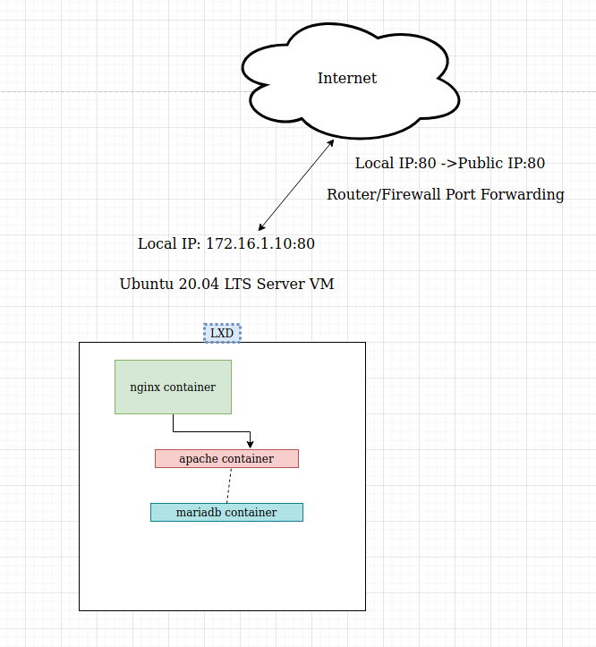
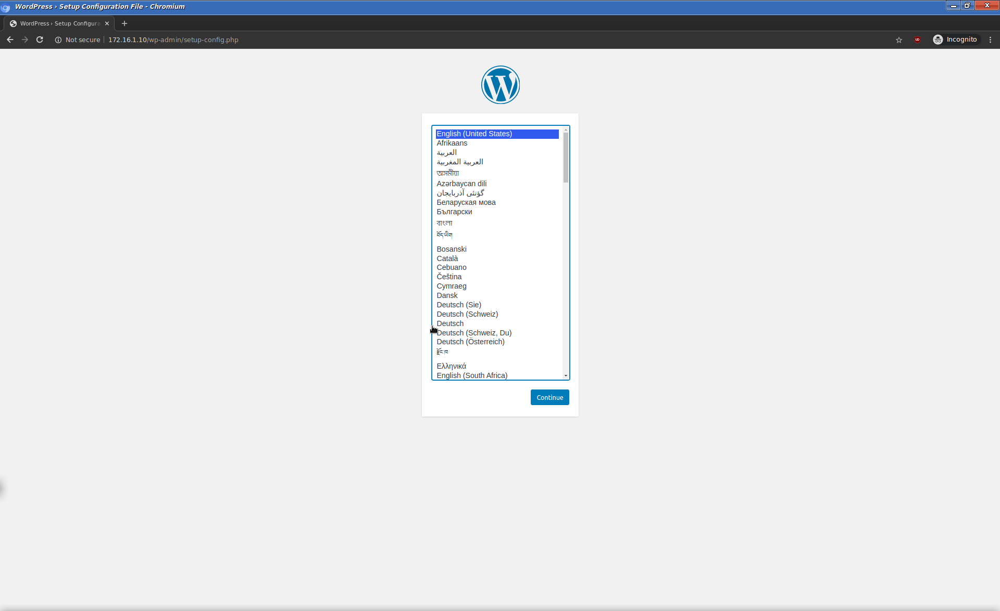
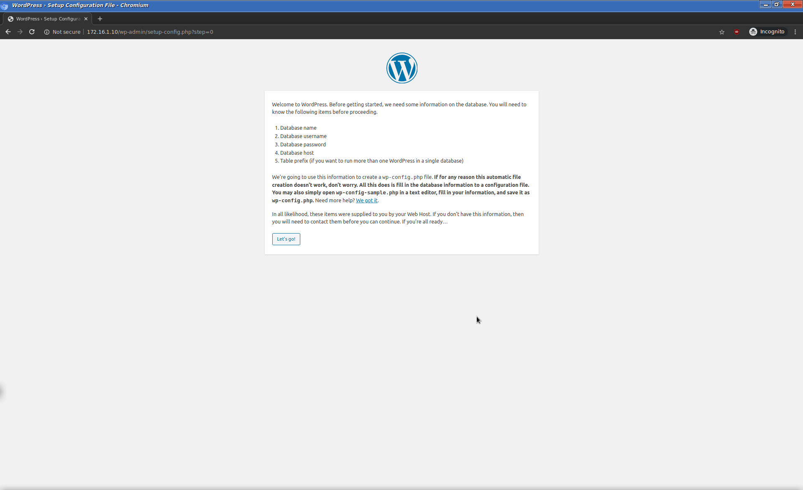
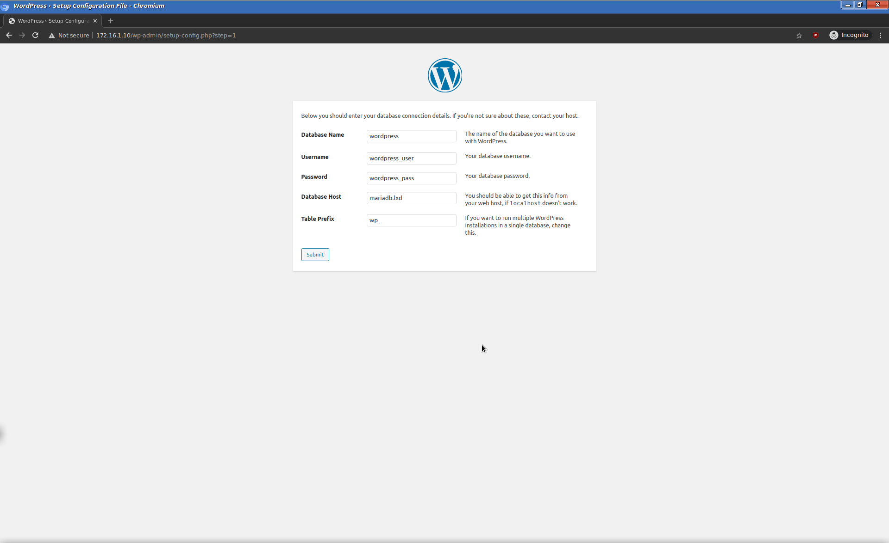
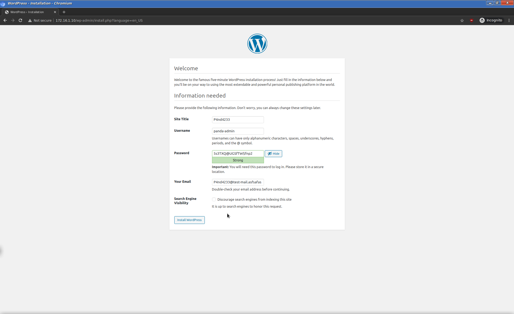
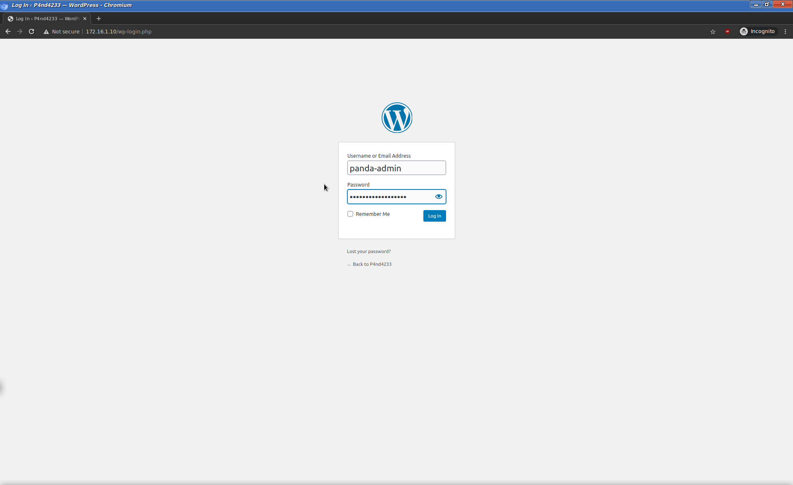
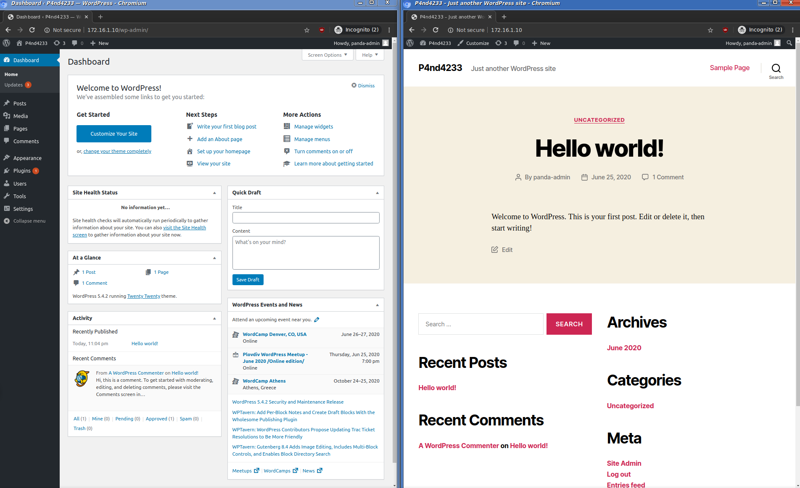

# WordPress containerization solution with LXD
* * *
Hello everyone, today we are going to take a look at [Linux Containers](https://linuxcontainers.org/), and using LXD for hosting a site with CMS (In this case a WordPress instance).
<p>
WordPress is, by far, the most popular open source Content Management System (CMS), used by approximately 75 million websites. WordPress is free to install, deploy, and upgrade. Thousands of plugins and templates power a flexible and simple interface, which reduces development costs and deployment time.
</p>

In our case we will use Ubuntu 20.04 LTS Server as the container host.
Bellow we can see a simple diagram of the setup we are going to use.
>TL;DR; <br>This definitely is not a production ready or ultra secure setup, it is for demonstration purposes on what we can do with LXD and containerization in general.

<a href="pics/lxd-wp/diagram1.png" target="_blank"></a>

### #1 LXD Host
#### Ubuntu 20.04 LTS Server (Local IP 172.16.1.10)
The LXD Host will run the containers and orchestrate the whole thing.
### #2 Nginx container (IP: 10.240.244.190)
The nginx server will act as a reverse proxy - port forward between the host and the container bridge
### #3 Apache container (IP: 10.240.244.97)
The apache container will be serving the CMS App via PHP
### #4 MariaDB container (IP: 10.240.244.105)
This container will handle the backend (WordPress) database

* * *
OK, with the topology taken care of, lets proceed with the installation.<br>
To install lxd run: 
```bash
$ sudo apt-get install lxd -y
```
If you get prompted, choose the latest version. <br>
Make sure that you are part of the `lxd` group,
```bash
$ id
uid=1000(ivan) gid=1000(ivan) groups=1000(ivan),4(adm),24(cdrom),27(sudo),30(dip),46(plugdev),115(lxd)
```
If you are not, run `sudo usermod -aG lxd $USER` <br>
Ok now we have to initialize LXD for the first time

```bash
$ sudo lxd init
Would you like to use LXD clustering? (yes/no) [default=no]: no
Do you want to configure a new storage pool? (yes/no) [default=yes]: yes
Name of the new storage pool [default=default]: default
Name of the storage backend to use (dir, lvm, zfs, ceph, btrfs) [default=zfs]: dir
Would you like to connect to a MAAS server? (yes/no) [default=no]: no
Would you like to create a new local network bridge? (yes/no) [default=yes]: yes
What should the new bridge be called? [default=lxdbr0]: lxdbr0
What IPv4 address should be used? (CIDR subnet notation, “auto” or “none”) [default=auto]: auto
What IPv6 address should be used? (CIDR subnet notation, “auto” or “none”) [default=auto]: auto
Would you like LXD to be available over the network? (yes/no) [default=no]: no
Would you like stale cached images to be updated automatically? (yes/no) [default=yes] yes
Would you like a YAML "lxd init" preseed to be printed? (yes/no) [default=no]: no
```
Of course you can choose other options, tweak the networking, i am leaving it to default. <br>
The storage pool option is very important, you can store the containers in a directory or in a different volume. We can create sperate LVM, and assign it to a [storage pool](https://linuxcontainers.org/lxd/docs/master/storage).
Storing in a dedicated LVM gives more flexibility, because you can backup more easily ,make the whole infrastructure portable, replicate it across different hosts.
I am going to choose the default option - dir.
The last option about YAML can be used to create homogeneous enviroment where there are many LXD hosts and you dont't need to go set them up one by one.

## The `Dir` backend

>While this backend is fully functional, it's also much slower than all the others due to it having to unpack images or do instant copies of instances, snapshots and images.
>Quotas are supported with the directory backend when running on either ext4 or XFS with project quotas enabled at the filesystem level.

OK, now lets checkout the network situation, we saw above that a new adapter (lxdbr0) was created
```bash
$ ip a
1: lo: <LOOPBACK,UP,LOWER_UP> mtu 65536 qdisc noqueue state UNKNOWN group default qlen 1000
    link/loopback 00:00:00:00:00:00 brd 00:00:00:00:00:00
    inet 127.0.0.1/8 scope host lo
       valid_lft forever preferred_lft forever
    inet6 ::1/128 scope host 
       valid_lft forever preferred_lft forever
2: ens33: <BROADCAST,MULTICAST,UP,LOWER_UP> mtu 1500 qdisc fq_codel state UP group default qlen 1000
    link/ether 00:0c:29:75:06:a1 brd ff:ff:ff:ff:ff:ff
    inet 172.16.1.10/24 brd 172.16.1.255 scope global ens33
       valid_lft forever preferred_lft forever
    inet6 fe80::20c:29ff:fe75:6a1/64 scope link 
       valid_lft forever preferred_lft forever
3: lxdbr0: <BROADCAST,MULTICAST,UP,LOWER_UP> mtu 1500 qdisc noqueue state UNKNOWN group default qlen 1000
    link/ether 36:ef:50:5e:1f:90 brd ff:ff:ff:ff:ff:ff
    inet 10.240.244.1/24 scope global lxdbr0
       valid_lft forever preferred_lft forever
    inet6 fd42:a868:c39b:3ff9::1/64 scope global 
       valid_lft forever preferred_lft forever
    inet6 fe80::34ef:50ff:fe5e:1f90/64 scope link 
       valid_lft forever preferred_lft forever
```
And indeed lxdbr0 is created, BUT that doesn't mean it is configured, we will come to this later.<br>
Now lets install the containers themselves.

Linux Containers is like Docker, in terms of images, there is a centralized repository (in Ubuntu there is specific Canonical Repo too)
[uk.images.linuxcontainers.org](https://uk.images.linuxcontainers.org/)
We can check out the website or use the command line. To query the lxc images, type
```bash
$ lxc image list images:
```
That way we get a long list of images available, we can add `| grep 'something'` to narrow it down...<br>

We have chosen an image(Ubuntu focal in our case), to fetch it we can either specify the FINGERPRINT or its ALIAS, we will use the fingerprint
```bash
$ lxc init images:30c3adc18d77 nginx
```
When the image finishes downloading we can list the available containters
```bash
$ lxc ls
+-------+---------+------+------+-----------+-----------+
| NAME  |  STATE  | IPV4 | IPV6 |   TYPE    | SNAPSHOTS |
+-------+---------+------+------+-----------+-----------+
| nginx | STOPPED |      |      | CONTAINER | 0         |
+-------+---------+------+------+-----------+-----------+
```
The container is in STOPPED state,
lets create the other 2 containers and start them so we can proceed with further setup

```bash
$ lxc init images:30c3adc18d77 apache # the last arguments is the container local name
$ lxc init images:30c3adc18d77 mariadb # the last arguments is the container local name
$ lxc start --all # start all containers
$ lxc ls
+---------+---------+-----------------------+-----------------------------------------------+-----------+-----------+
|  NAME   |  STATE  |         IPV4          |                     IPV6                      |   TYPE    | SNAPSHOTS |
+---------+---------+-----------------------+-----------------------------------------------+-----------+-----------+
| apache  | RUNNING | 10.240.244.97 (eth0)  | fd42:a868:c39b:3ff9:216:3eff:fe05:b6ab (eth0) | CONTAINER | 0         |
+---------+---------+-----------------------+-----------------------------------------------+-----------+-----------+
| mariadb | RUNNING | 10.240.244.105 (eth0) | fd42:a868:c39b:3ff9:216:3eff:fed6:808c (eth0) | CONTAINER | 0         |
+---------+---------+-----------------------+-----------------------------------------------+-----------+-----------+
| nginx   | RUNNING | 10.240.244.190 (eth0) | fd42:a868:c39b:3ff9:216:3eff:fed7:7b24 (eth0) | CONTAINER | 0         |
+---------+---------+-----------------------+-----------------------------------------------+-----------+-----------+
```
Now the containers are running, they are assigned an ip address automatically by LXD.
At this part the things were pretty straightforward. Now
to install nginx instide the container we must interact with it.
To do so run `$ lxc exec nginx -- bash`
Now we get dropped inside a root shell in the container itself.
To install nginx we run:
```bash
apt-get install nginx -y; systemctl enable --now nginx
```
`systemctl enable --now nginx` - start and enable the nginx daemon to autostart at boot
<br>
### Now lets do some portforwarding from the container to port 80 on the real host

We can add a proxy device to the nginx container. <br>
`$ lxc config device add nginx proxy-device proxy listen=tcp:0.0.0.0:80 connect=tcp:127.0.0.1:80`

Well ok, BUT we are not done, if we take a look at `/var/log/nginx/access.log`<br>
we can see the following: `127.0.0.1 - - [25/Jun/2020:21:03:20 +0000] "GET / HTTP/1.1" 200 612 "-" "curl/7.58.0"`
That is bad, the logging is broken, we access the site from the outside, but it show that it is from localhost.<br>
That's because nginx is unaware of the proxy, lets fix that...
`$ lxc config device set nginx proxy-device proxy_protocol=true`<br>
and in the container lets edit the nginx configuration file `/etc/nginx/sites-available/default`. We should put the following at the `server { ... }` directive
```bash
 server {
		listen  80 proxy_protocol;
		server_name localhost;
 }

     real_ip_header proxy_protocol;
     set_real_ip_from 127.0.0.1; # any internal request will trust the header of the set

```
Now we can run `nginx -t` to test the configuration. If everything is ok we can run `systemctl restart nginx`

Now if we take a look at the access.log we can now see the real client ip address

```bash
$ lxc exec nginx -- tail -f /var/log/nginx/access.log

==> /var/log/nginx/access.log <==
172.16.1.20 - - [25/Jun/2020:21:36:34 +0000] "GET / HTTP/1.1" 200 612 "-" "curl/7.65.3"
```
### Configuring the Proxy

Lets install apache2 inside it's container, lets run `apt-get install apache2 -y ; systemctl enable --now apache2`
Now we have to forward nginx to apache. In nginx container, lets add the following to `/etc/nginx/sites-available/default` inside the `server { ... }` directive
```bash
server {
			listen  80 proxy_protocol;
			server_name localhost;

           	location / {
           		proxy_set_header Host $host;
           		proxy_set_header X-Real-IP $remote_addr;
           		proxy_pass http://apache.lxd;
			}
 }

         real_ip_header proxy_protocol;
         set_real_ip_from 127.0.0.1;

```

>Because we are attached to the LXD bridge, the internal DNS service will resolve the container's hostname. We will use that, instead you can set static IP for each container.

Now if we browse to the host ip we will see the deafult apache page, however the logs for apache are not set for proxy, lets do that
```apacheconf
$ vim /etc/apache2/apache2.conf

LogFormat "%v:%p %h %l %u %t \"%r\" %>s %O \"%{Referer}i\" \"%{User-Agent}i\"" vhost_combined
LogFormat "%a %l %u %t \"%r\" %>s %O \"%{Referer}i\" \"%{User-Agent}i\"" combined
LogFormat "%a %l %u %t \"%r\" %>s %O" common
LogFormat "%{Referer}i -> %U" referer
LogFormat "%{User-agent}i" agent
```
Change the %h on line `213` and `214` to %a

and lets add `RemoteIPHeader` and `RemoteIPInternalProxy` (the last 2 lines from bellow) to `/etc/apache2/sites-available/000-default.conf`

```apacheconf
<VirtualHost *:80>
        ServerAdmin webmaster@localhost
        DocumentRoot /var/www/html

        ErrorLog ${APACHE_LOG_DIR}/error.log
        CustomLog ${APACHE_LOG_DIR}/access.log combined

        RemoteIPHeader X-Real-IP
        RemoteIPInternalProxy nginx.lxd
</VirtualHost>

```
and last run `a2enmod remoteip; systemctl restart apache2`

We can check out the logs and see that both apache and nginx are logging information correctly

```bash
$ lxc exec nginx -- tail -f /var/log/nginx/access.log /var/log/nginx/error.log

==> /var/log/nginx/access.log <==

172.16.1.20 - - [25/Jun/2020:22:06:59 +0000] "GET / HTTP/1.1" 200 10918 "-" "curl/7.65.3"
172.16.1.20 - - [25/Jun/2020:22:07:04 +0000] "GET / HTTP/1.1" 200 10918 "-" "curl/7.65.3"
172.16.1.20 - - [25/Jun/2020:22:08:52 +0000] "GET / HTTP/1.1" 200 10918 "-" "curl/7.65.3"
172.16.1.20 - - [25/Jun/2020:22:08:53 +0000] "GET / HTTP/1.1" 200 10918 "-" "curl/7.65.3"
```
```bash
$ lxc exec apache -- tail -f /var/log/apache2/access.log /var/log/apache2/error.log

==> /var/log/apache2/access.log <==
fd42:a868:c39b:3ff9:216:3eff:fed7:7b24 - - [25/Jun/2020:22:08:52 +0000] "GET / HTTP/1.0" 200 11192 "-" "curl/7.65.3"
172.16.1.20 - - [25/Jun/2020:22:08:53 +0000] "GET / HTTP/1.0" 200 11192 "-" "curl/7.65.3"
```
* * *
### Done with the proxy, now lets configure MariaDB
```bash
lxc exec mariadb -- bash
apt-get install mariadb-server -y
mysql_secure_installation # always make sure to run that to remove any default values
```
#### Next we need to change the bind address because by default it only allows connections on localhost, and we want to connect from the apache container
To do so, go to `/etc/mysql/mariadb.conf.d/50-server.cnf` and edit line 28 to
`bind-address            = 0.0.0.0` <br>
then `systemctl restart mariadb`
> We separated the DB from Apache, because this way we can make independent changes on WordPress/Apache, without affecting the database
> ,or we can do a snapshot on only one component of the infrastructure

* * *
### Lets configure Apache for WordPress

> We can attach a volume to the container's `/var/www/html` directory, because if something goes wrong and we have to delete the container, the WordPress installation will stay intact. In my case I will not do that, but it is a good practice.

```bash
apt-get install wget unzip -y
wget https://bg.wordpress.org/latest-bg_BG.zip
unzip latest-bg_BG.zip
mv wordpress/ /var/www/html/
chown -R www-data:www-data /var/www/html/
apt-get install -y php-curl php-gd php-mbstring php-xml php-xmlrpc php-soap php-intl php-zip php libapache2-mod-php php-mysql
```

Lets change the document root in Apache to the WordPress directory, and also allow permalinks for WordPress.
Edit `/etc/apache2/sites-available/000-default.conf`

```apacheconf
DocumentRoot /var/www/html/wordpress

<Directory /var/www/html/wordpress>
                AllowOverride All
</Directory>
```
Then run:

```bash
a2enmod rewrite
systemctl restart apache2
```

### Lets set up MariaDB

Now we should create a database for WordPress

`$ mariadb -u root`

```sql
create database wordpress default character set utf8mb4 collate utf8mb4_unicode_520_ci;

grant all on wordpress.* to 'wordpress_user'@'apache.lxd' identified by 'wordpress_pass';

flush privileges;

exit;

```

> ATTENTION! Please pick better database username and password, make them complicated and hard to guess.

Now everything should be good to go ...<br>
* * *
## Lets try it!

<a href="pics/lxd-wp/pic2.png" target="_blank"></a>

### It Works!

Now lets get through the initial setup

<a href="pics/lxd-wp/pic3.png" target="_blank"></a>
<a href="pics/lxd-wp/pic4.png" target="_blank"></a>
> ↑ Here we must enter the user and password exactly like we specified them in MariaDB before

<a href="pics/lxd-wp/pic5.png" target="_blank"></a>
<a href="pics/lxd-wp/pic6.png" target="_blank"></a>
<a href="pics/lxd-wp/pic7.png" target="_blank"></a>
> ↑ We can see that the site is up and running

* * *

<p> That's it for now, this was just a brief introduction to what we can do with such infrastructure. Containerization is very flexible technology. It is used in hosting and development enviroments. With the images available for download we can build very complicated scenario. Create a template, to deploy in matter of seconds.</p>