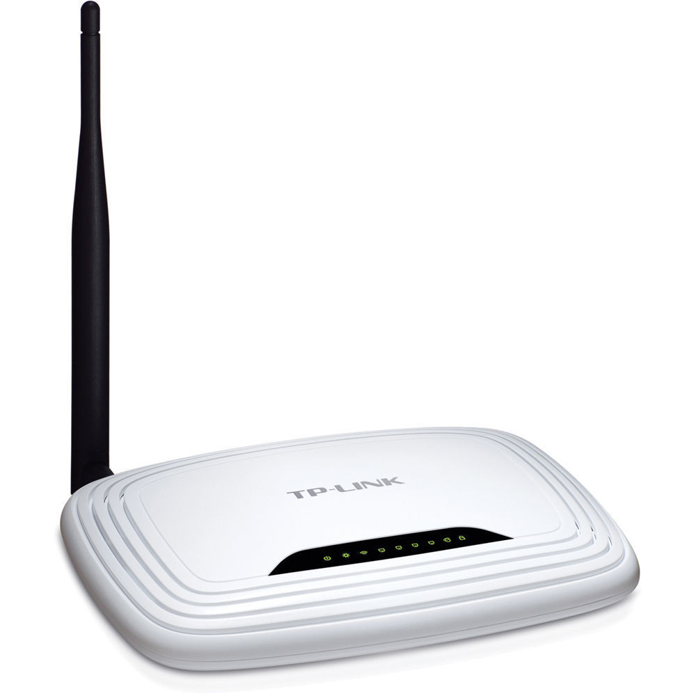
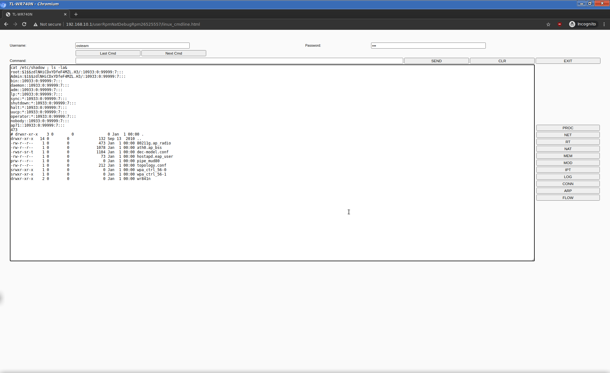

# [PART 1] Renovating an old network for nearly free

* * *

## The Problem

In many companies in 2020 there is still very big number of old networking hardware that is being used.

> "<strong><a href="https://www.csoonline.com/article/3124937/73-of-companies-using-vulnerable-end-of-life-networking-devices.html" target="blank">73% of companies using vulnerable end-of-life networking devices</a></strong>"

This is a big risk, because if not maintained properly, old hardware contains software bugs, and vulnerabilities. Because many of these old products are already end of life, there are no updates available from the manufacturer. Also the productivity goes downhill, because of the slower speed that they support and older standards.  
To modernize the networking equipment can mean a lot of expenses and hustle to buy new one, and taking the network down creates inconveniences.
People are going with the saying "If it works, don't touch it, it will break", that is dangerous way of thinking, because stuff always break, thats how it was build, this is how the modern consumerism works.

## Getting to the point.

OK so I thought: "How we can "modernize" our network from software point of view, if spending money on physical hardware is NOT an option ..."
I will focus only on 3 things here, more likely representing the environment in one small business office, since we can't take a look at the bigger infrastructure without the article becoming too big, and also you should never cut corners on security and productivity.

> 1) The main Wireless Router (If you don't have dedicated WLAN AP)  
> 2) Put on separate VLAN everything that can't be updated(out-of-life IOT, everything that is running embedded very out-of-date Linux Kernel, etc...)  
> 3) Why you should have a proper DMZ set up in your network  

### 1) The main Wireless Router

If you router is old and outdated model, you should consider updating it. This is the gateway between the Internal/External Network (the other name for router is Gateway). One - it can malfunction and cut you from the Internet, or give you false sense of security. You should think about it as your front door, you don't want it to be flimsy and all rusted, since everyone can get inside and steal the things in your office, this is the same thing. Think about it, nowadays not everyone works with paper documents, and if he/she does, from where these documents come from? Yes somebody types them inside Microsoft Word, or gets a PDF and prints them out. So if someone gets a hold of the contents of your computer, he/she will get these documents you work with too ...

Here i can type all day why you should keep everything up to date, and patch and patch and check,and use reliable equipment, BUT i think it will have more effect if i demonstrate it in my lab, so you can see yourself.

I have stumbled upon, many articles online, or even shows on TV that explain how important is cybersecurity for your business. BUT what I have seen is that, they are filled with stock photos taken from Google, or some movie cut scenes. Nobody shows how it looks really like. They show only some dry theory. So I will show you the real deal (kind of, from pen test point of view).
I will try to recreate a real scenario, it also can be very familiar to your own company too.

I will have a WiFi Router in my case the good old and very, very, widely used TPLink TL-WR740n

> This one, I bet you have seen it at least once 

And a Windows 7 PC connected to it. (Since we are taking a look at a little scenario here, I will skip the Domain Controller and AD part, but this has nothing to do with them).

Here is the scenario: <i>I want to get a hold of the Business's Internal Network and get the sensitive data out of the computers and ruin your company. Thats how i can do it, because you are using very old hardware and software </i>.

What a perfect combination, old, outdated OS and networking hardware, lets see what we can do ...

#### Step 1 - Find out the WiFi Network and look for vulnerabilities

There are several ways to get inside the WiFi network, from capturing the 4-way WPA handshake and cracking it to obtain the credentials, to complicated KRACK attacks. <a href="https://en.wikipedia.org/wiki/Wi-Fi_Protected_Access#Security_issues" target="_">[1]</a>
I have tested this router and if it is vulnerable to another attack vector called `Pixiedust attack` which exploits a flaw in how the random numbers are generated in some routers and WPS <a href="https://en.wikipedia.org/wiki/Wi-Fi_Protected_Setup" target="_blank">[2]</a>. Fortunately it seems not. We are going to use another, more classic method, deauthenticating a user, capturing the 4-way handshake and cracking it.

> How is that possible? Well WiFi isn't such a secure communication, since it if you have the password for the network, you can decrypt all the traffic, and get information if it is not encrypted on itself. And because it is a radio signal it can be caught even from far away if you have a good antenna.  
> How deauthenticaion works (<a href="https://en.wikipedia.org/wiki/Wi-Fi_deauthentication_attack" target="_blank">Wikipedia</a>) : "... deauthentication acts in a unique way. The IEEE 802.11 (Wi-Fi) protocol contains the provision for a deauthentication frame. Sending the frame from the access point to a station is called a "sanctioned technique to inform a rogue station that they have been disconnected from the network""  
> Basically the frame saying "You must disconnect right now" can be a legitimate frame, send from the AP. Since it is unprotected, we can send that frame too, saying we are the AP and cause the client to disconnect. This wouldn't be possible if it was protected like the rest of the communication, there is a standard that fixes the issue, but nobody uses it - <a href="https://en.wikipedia.org/wiki/IEEE_802.11w-2009" target="_blank">IEEE 802.11w-2009</a>

Choosing this method we are using a word list, and if the password is not in the word list, we won't get the credential.
#### Step 2 - Connect and gather information (enumeration).
When we get on the network, we can obtain more information about what devices are on it, what software they use, etc...  
In our case, because of this old hardware, we found out with a simple Google Search that there is publicly know back door and on some new ones, even an <strong> RCE vulnerability </strong>. TP-link has released patches, but in our case the firmware was never updated, and I guess like many other's. There is popular equipment out there, which gets never patched.

> There is root web shell, with known credentials. If you google it you can find out more.

#### Step 3 - Exploit it, and get access to what you shouldn't ...

## DEMO TIME

> Disclaimer! Do NOT use this against somebody else, I am testing it inside my lab environment with Virtual Box. I am just showing known techniques you can find online anyway.

<iframe src="https://player.vimeo.com/video/452550799?color=ff9933&byline=0&portrait=0" style="position:absolute;top:0;left:0;width:100%;height:100%;" frameborder="0" allow="autoplay; fullscreen" allowfullscreen></iframe>

## Conclusions
We can assume that this router - TPLink WR740n v2 is actually pretty safe, because the problem here was the weak WiFi password itself. Although the stock firmware doesn't give us a lot of options, like VLANS for example. If the Windows 7 computer, still unpatched, but put on another isolated VLAN, this wouldn't have happened, or at least that way. Also if attacker had access to the admin panel of the router, he/she could change the DNS settings, and show phishing pages look like legitimate webistes, and much more.

I was unable to find a vulnerability here, that doesn't mean there isn't. If everything was that simple there won't be Mirai outbreak. <a href="https://en.wikipedia.org/wiki/Mirai_(malware)" target="_blank">[3]</a>

## In the next part you will see how to update the software on your networking equipment,and tips to prevent such intrusions : <a href="tp_link-2.html">PART 2</a>