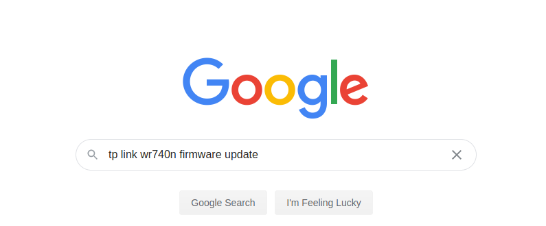
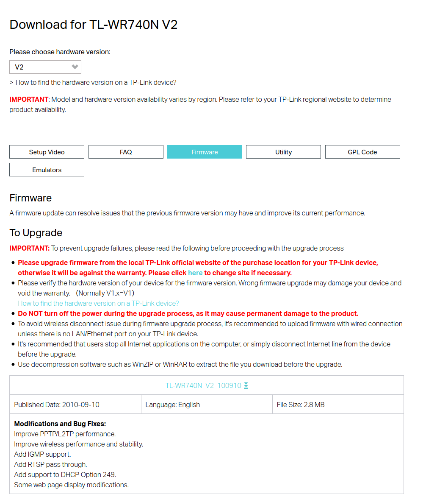
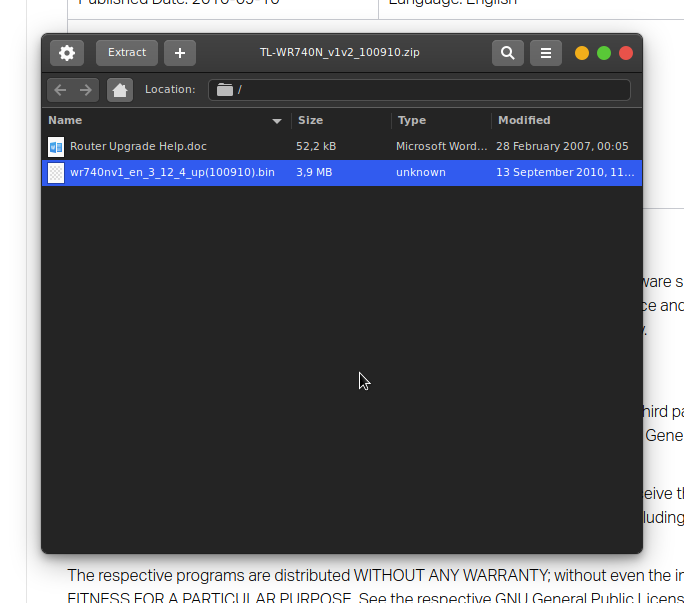
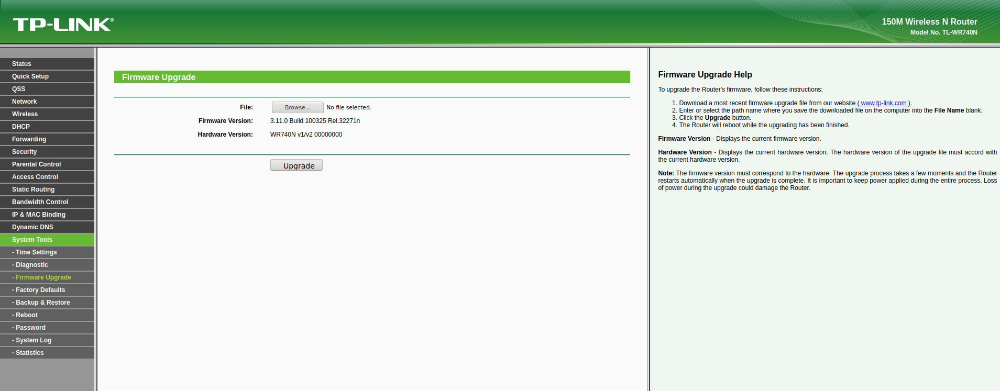
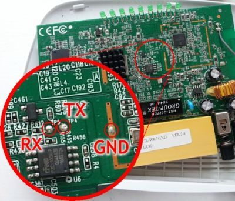
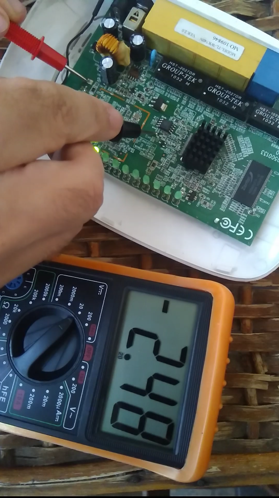
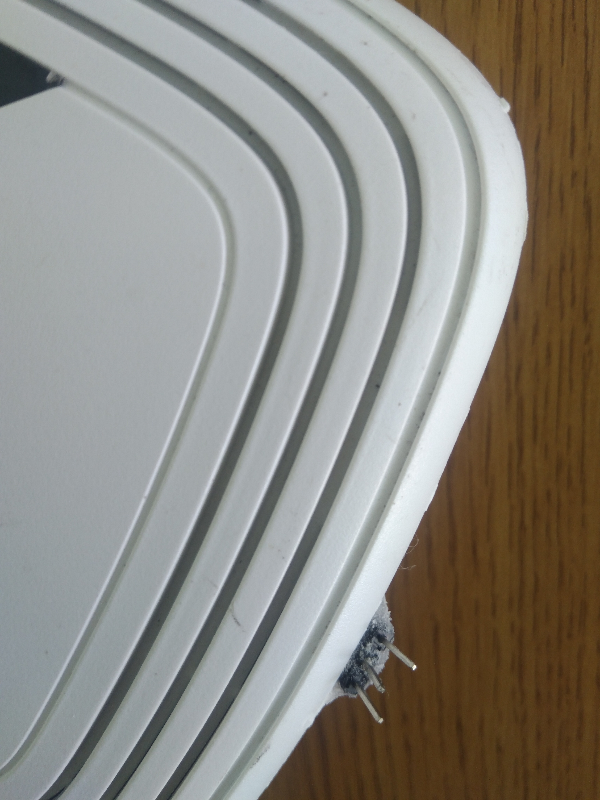
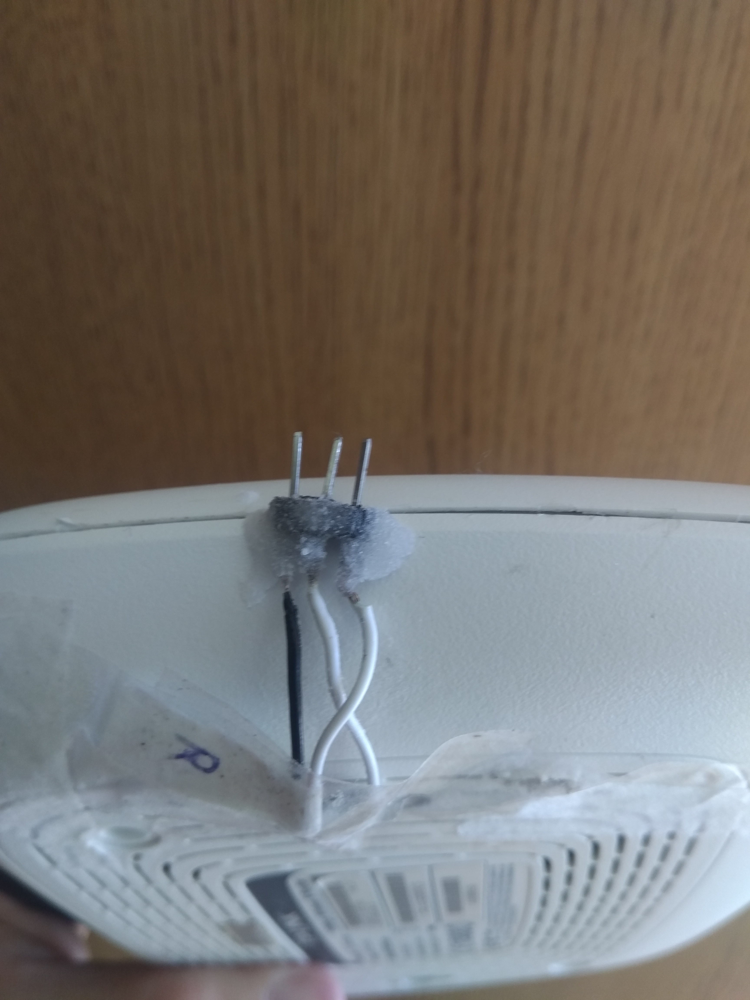
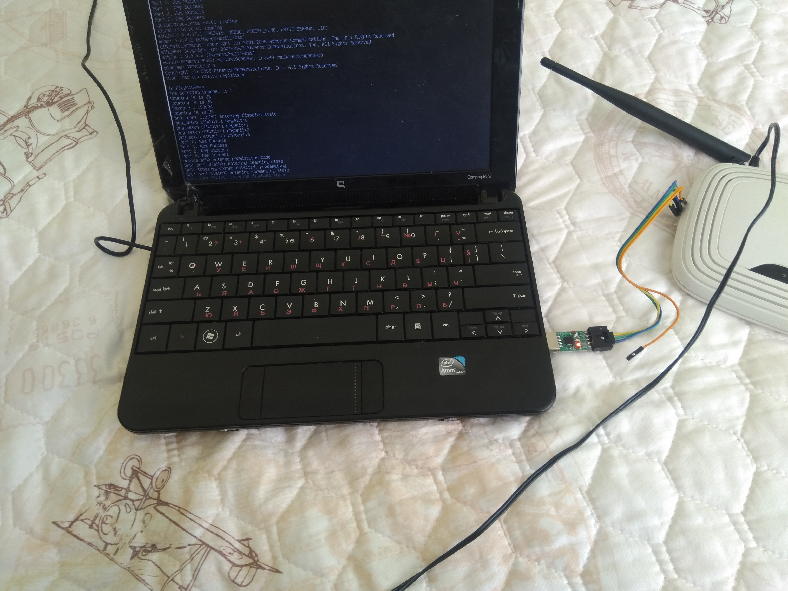

# [PART 2] Renovating an old network for nearly free

* * *

## Updating the firmware of your WiFi Router for better security and management

In <a href="tp_link-1.html" target="_blank">PART 1</a> I have tested and explained what dangers and inconveniences poses, old embedded hardware. And how a badly organized network is a big problem.
Here I am going to show you, how you can modernize your out-of-date router. We will stick to the agenda bellow:

> ### AGENDA
> <a href="tp_link-2.html#1">1) Updating the firmware of the router, from the vendors website (if the product is not out-of-date)</a>  
> <a href="tp_link-2.html#2"> 2) Installing custom open source firmware </a> 
> <a href="tp_link-2.html#3">- Exposing the UART port </a> 
> <a href="tp_link-2.html#4">- OpenWRT Installation and initial configuration </a> 

> 3) Intro to Best Networking Practices in general (some shown on OpenWRT)(<a href="tp_link-2.html#9">summed up variant</a>)
>  - <a href="tp_link-2.html#5">Guest only WiFi network </a>  
>  - <a href="tp_link-2.html#6">WPA Enterprise</a>  
>  - <a href="tp_link-2.html#7"> VLANs </a> 
>  - <a href="tp_link-2.html#8">DMZ</a>  

## 1) Updating the firmware of the router, from the vendors website (if the product is not out-of-date)

You can just google the make and model followed by firmware update, and download the image, provided on the manufacturer's website .

As in my case i will download the firmware for wr740n ver 2.

After you download you extract the zip, and you can, go to the web management console of the router, then to the firmware upgrade page and proceed.

In our case that is not an option since the latest firmware was released back in 2010-09-10 ...

## 2) Installing custom open source firmware

### Exposing the UART port - Optional BUT Recommended

> I recommend watching this <a href="https://www.youtube.com/watch?v=sTHckUyxwp8" target="_blank"> UART Protocol Explanation Video</a> . Here I will explain it plain and simple.

<a href="https://en.wikipedia.org/wiki/Universal_asynchronous_receiver-transmitter" target="_blank">UART</a> is basically fancy for Serial Port. The UART port in practice is used for debugging the software that is running on the embedded system. During the engineering process, one of the ways programmers are testing their firmware that is going to be put on the final product is via UART. Most devices have UART or a <a href="https://en.wikipedia.org/wiki/JTAG" target="_blank">JTAG connector</a> (which is different, we will "cover" only UART here).

#### What it gives to us?
So if we can use that type of interface to interact with the device on a level that is not possible other way. It gives us access that only the Manufacturer/Developer was intended to have. And in our case we want exactly that.
There are many videos online covering exactly what we can do, and how we do it.

Because you don't want to brick your hardware, since you are installing something that is custom, always a good practice is having a backup plan, since you don't know what can happen. 
If the wifi and lan does not respond and something goes wrong during the upgrade process, we can debug the router this way. And for further use of the router, it is good to have alternative interface option. We will use the built in UART serial console <a href="https://en.wikipedia.org/wiki/Universal_asynchronous_receiver-transmitter" target="_blank">[1]</a>. By doing this you can get direct access to the router's bootloader and flash firmware this way. More on that can be found on "Debricking" on the OpenWRT site.<a href="https://openwrt.org/toh/tp-link/tl-wr740n" target="blank">[2]</a> In ver 2 of this particular model, it is a little bit quirky, but still works, since most devices have through holes on the PCB, which are very distinguishable, our does not. Although with some googling we can find that there are probe points on the board, which are the RX and TX pins use for the UART communications.

  
And if we test with the multimeter, indeed the labeling is correct. <strong>TP4</strong> is <strong>TX</strong> and <strong>TP5</strong> is <strong>RX</strong>.

  

So I have soldered 3 wires to these pins, 1 to TX, 1 to RX and 1 to a ground pad. Run the wires out of the case, by breaking the plastic on the bottom, and soldering header pins to the end of the wires, so we can connect them to <a href="https://www.aliexpress.com/wholesale?catId=0&initiative_id=SB_20200831113029&SearchText=usb+uart+adapter" target="_blank">UART-to-USB interface</a>, and get a serial console.   
> Tip 1: Use different-colored wires for the different pads, if you don't have, like me, make sure to label them correctly  
> Tip 2: because the connection between the header and the wire is not as structurally strong, i have used super glue and sprinkled some baking soda on top, to make the bonding harden more, and stick the 2 plastic pieces together.

  
  

If we connect to the adapter, we can see output inside the terminal, by running `screen /dev/ttyUSB0 115200` on linux, or with <a href="https://www.putty.org/" target="_blank">Putty</a> on Windows, by specifying the correct COM port and baud rate of 115200.

  

### Installing OpenWRT
There are several open source projects online, which give us the option the put second life to our obsolete router hardware.
Some of the most famous are <a href="https://dd-wrt.com/" target="_blank">DD WRT</a> and <a href="https://openwrt.org/" target="_blank">Open WRT</a> .
We will not go on deep dive which one is better, etc ... You can do your research online which one to use, here we will explain how to flash Open WRT on WR 740 N.

If we google `"wr740n openwrt"`, we get the official project web page, from where we can see instructions and download the custom image.
 <a href="https://openwrt.org/toh/tp-link/tl-wr740n" target="_blank">`https://openwrt.org/toh/tp-link/tl-wr740n`</a>  Then we download the image for our hardware version, and repeat the flashing process from <a href="tp_link-2.html#1">(1)</a>.

Since the article will become too long, and I do know that is boring, and you want to get straight to the point, I am going to create a quick video tutorial that will show you how to install and configure for initial use OpenWRT on WR 740n.

<iframe src="https://player.vimeo.com/video/453635394?color=ff9933&byline=0&portrait=0" style="position:absolute;top:0;left:0;width:100%;height:100%;" frameborder="0" allow="autoplay; fullscreen" allowfullscreen></iframe>

### Video on setting up Guest WiFi Network

<iframe src="https://player.vimeo.com/video/453652697?color=ff9933&byline=0&portrait=0" style="position:absolute;top:0;left:0;width:100%;height:100%;" frameborder="0" allow="autoplay; fullscreen" allowfullscreen></iframe>

## WPA-Enterprise

"WPA-Enterprise (WPA-802.1x, RADIUS):
This mode provides the security needed for wireless networks in business environments. It is more complicated to set up, and it offers individualized and centralized control over access to your Wi-Fi network. When users try to connect to the network, they need to present their login credentials.
This mode supports 802.1x RADIUS(Remote Authentication Dial-in User Service) authentication and is appropriate in the cases where a RADIUS server is deployed. WPA-Enterprise should only be used when a RADIUS server is connected for client authentication. 
Users never deal with the actual encryption keys. They are securely created and assigned per user session in the background after a user presents their login credentials. This prevents people from getting the network key from computers." - <a href="https://www.tp-link.com/us/support/faq/500/" target="_blank">Source: TP-Link FAQ</a>

I am willing to show you how to set it up, but unfortunately the TP-Link WR740N is too old and hasn't got enough space to install `wpad`, which is the full version of the package that supports WPA-802.1x authentication(`wpad-mini` currently installed). As I said, some of those enterprise level features to be used require a little bit more modern hardware.

## Introduction to VLANs
"VLANs (Virtual LANs) are logical grouping of devices in the same broadcast domain. VLANs are usually configured on switches by placing some interfaces into one broadcast domain and some interfaces into another. Each VLAN acts as a subgroup of the switch ports in an Ethernet LAN.

A VLAN acts like a physical LAN, but it allows hosts to be grouped together in the same broadcast domain even if they are not connected to the same switch. Here are the main reasons why VLANs are used:

* VLANs increase the number of broadcast domains while decreasing their size.
* VLANs reduce security risks by reducing the number of hosts that receive copies of frames that the switches flood.
* you can keep hosts that hold sensitive data on a separate VLAN to improve security.
* you can create more flexible network designs that group users by department instead of by physical location.
* network changes are achieved with ease by just configuring a port into the appropriate VLAN.

Without VLANs, a broadcast sent from host A would reach all devices on the network. Each device will receive and process broadcast frames, increasing the CPU overhead on each device and reducing the overall security of the network.

By placing interfaces on both switches into a separate VLAN, a broadcast from host A would reach only devices inside the same VLAN, since each VLAN is a separate broadcast domain. Hosts in other VLANs will not even be aware that the communication took place.
" - <a href="https://study-ccna.com/what-is-a-vlan/" target="_blank">Source: Study-CCNA.com</a>

This is a quick intro into VLANs by Study-CCNA.com. A technology from the 80's which makes your network: <strong> organized, cleaner, easier to manage, faster and more secure.</strong> It is just a must in an enterprise environment.

## VLAN based DMZ

### What is DMZ ?
"In computer security, a DMZ or demilitarized zone (sometimes referred to as a perimeter network or screened subnet) is a physical or logical subnetwork that contains and exposes an organization's external-facing services to an untrusted, usually larger, network such as the Internet. The purpose of a DMZ is to add an additional layer of security to an organization's local area network (LAN): an external network node can access only what is exposed in the DMZ, while the rest of the organization's network is firewalled. The DMZ functions as a small, isolated network positioned between the Internet and the private network .
The name is from the term "demilitarized zone", an area between states in which military operations are not permitted. " - <a href="https://en.wikipedia.org/wiki/DMZ_(computing)" target="_blank">Source: Wikipedia.org</a>

Basically it is a way of dividing the Public accessible services on your network, like your web server or mail server and the rest of the Local Area Network(LAN), so if the servers get compromised, the local network, will be isolated by design.

## <u>Best Practices</u>
### 1) Network Segmentation
* Don't create, too many VLANs since it becomes very hard to manage these networks. Don't overcomplicate things, the goal is to make an organized and secure network.

#### a) Separate VLANs for IOT Devices
#### <u>Trust, but verify</u>
Cheap chinese devices like IP cameras for example, use P2P traffic to be watched online, outside of the LAN. Peer2Peer traffic is hard to block. It has the ability to penetrate firewalls, by design. Make sure what your devices are doing. Use `Wireshark` and check what connections are established and what protocols are being used.
#### b) Separate DMZ(can be VLAN based too) for publicly exposed resources
* This means the Exposed host cannot access the internal network, or if needed to* , doing it in a filtered, restricted fashion. 
*<strong>Example:</strong> The web-server accessing a MySQL Database which is on the LAN, we should only port-forward the MySQL port to the DMZ VLAN and make sure the FireWall is configured correctly. The firewall becomes a single point of failure in this case.  
*It is recommended to use an web application firewall (WAF), for better application layer(7) security.
  
* A <strong> DMZ host is NOT a proper DMZ configuration</strong>, since it is on intranet(LAN), but it is not firewalled, a.k.a this makes things even worse! Be very careful if you use "DMZ host".

#### c) Create separate network(VLAN) for the guests and all untrusted devices. They don't need to have access to the internal internal services (AD DS for example), they just need an Internet connection.

### 2) Make sure to update your networking equipment firmware, it is part of the system as a whole too.

### 3) If you can, use firewall like pfSense or other solutions, many times built-in router firewalls are just not customizable enough.
* pfSense for example, can get it's functionality extended, as an Intrusion Detection System (IDS). There are solutions available, and can be natively installed like: `Suricata` or `Snort`. If so, it will <strong> require more processing power</strong>, because of the <strong>real time traffic monitoring = more expensive hardware.</strong>

### 4) Implement a strong password policy.
* <a href="https://docs.microsoft.com/en-us/microsoft-365/admin/misc/password-policy-recommendations?view=o365-worldwide" target="_blank">This</a> is a good and quick read.

## Conclusion

With Custom Router Firmware you get the best out of the hardware, you unlock new features, you get better manageability, even network level automation, creating backups of the network configuration, features you can get from the most modern equipment only. Of course this will not be a placebo to everything, but it is a good beginning, and also it is <strong> completely free of charge </strong>.